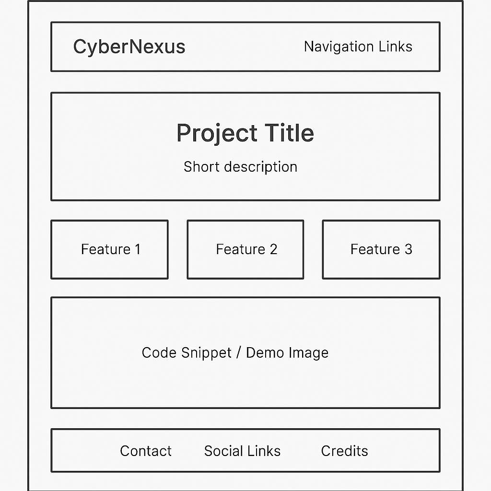

# Sabbir Ahmed's Portfolio

## About Me
Hello! I'm Ahmed, a passionate **cybersecurity student** with a strong interest in **networking, information security, and ethical hacking**. My goal is to become an expert in cybersecurity and contribute to protecting digital infrastructures. 

## My Dream
I aspire to work in the **cybersecurity field**, specializing in **penetration testing, network security, and threat analysis**. Through continuous learning and hands-on projects, I aim to develop advanced skills in **Python programming, ethical hacking, and system security**.

## Project Overview
This is my **portfolio repository**, where I'll be showcasing my skills and projects. This repository will include:
- A personal **website** (coming soon)
- Cybersecurity-related **projects**
- Technical **blogs** and documentation

## Repository Structure
```
/portfolio
  ├── README.md  # Project Overview
  ├── assets/    # Images and design files
  ├── src/       # Website source code (HTML, CSS, JS)
  ├── projects/  # Cybersecurity and Python projects
  ├── docs/      # Technical documentation
```

## Next Steps
- [ ] Plan the website structure (Week 2)
- [ ] Design a logo (Week 2)
- [ ] Build the homepage (Week 3+)

## Connect With Me
- **GitHub:** [https://github.com/sabbir-ahmed3]
- **LinkedIn:** [Coming Soon]
- **Email:** [Coming Soon]


Added Logo


added wireframe
## Project Wireframe  



<!DOCTYPE html>
<html lang="en">
<head>
    <meta charset="UTF-8">
    <meta name="viewport" content="width=device-width, initial-scale=1.0">
    <title>CyberNexus - Home</title>
    <style>
        body {
            font-family: Arial, sans-serif;
            margin: 0;
            padding: 0;
            background-color: #f4f4f4;
        }
        header {
            background-color: #222;
            color: white;
            padding: 15px;
            text-align: center;
        }
        nav {
            background: #444;
            padding: 10px;
            text-align: center;
        }
        nav a {
            color: white;
            text-decoration: none;
            margin: 0 15px;
            font-size: 18px;
        }
        .container {
            padding: 20px;
            text-align: center;
        }
        .logo {
            width: 150px;
        }
    </style>
</head>
<body>

    
</body>
</html>


git add index.html
git commit -m "Added homepage with header and navigation"
git push origin main


<!DOCTYPE html>
<html lang="en">
<head>
    <meta charset="UTF-8" />
    <meta name="viewport" content="width=device-width, initial-scale=1.0" />
    <title>CyberNexus - Home</title>
    <style>
        body {
            margin: 0;
            font-family: 'Segoe UI', Tahoma, Geneva, Verdana, sans-serif;
            background-color: #f9f9f9;
            color: #333;
        }
       header {
            background-color: #1e1e2f;
            color: white;
            padding: 20px 0;
            text-align: center;
        }
        .logo {
            width: 120px;
            margin-bottom: 10px;
        }

   nav {            background-color: #2c2c3c;
            display: flex;
            justify-content: center;
            padding: 10px 0;
        }
      nav a {
            color: white;
            text-decoration: none;
            margin: 0 20px;
            font-size: 17px;
            padding: 8px 15px;
            transition: background 0.3s;
        }
        nav a:hover {
            background-color: #3e3e5e;
            border-radius: 5px;
        }
        .container {
            max-width: 900px;
            margin: 40px auto;
            padding: 0 20px;
            text-align: center;
        }
 h2 {
            color: #1e1e2f;
        }
        p {
            font-size: 18px;
            line-height: 1.6;
            color: #555;
        }
        footer {
            text-align: center;
            padding: 20px;
            background-color: #1e1e2f;
            color: white;
            margin-top: 40px;
        }
    </style>
</head>
<body>


   <header>
        
        <h1>Welcome to CyberNexus</h1>
        <p>Cybersecurity | Innovation | Knowledge Sharing</p>
    </header>

   <nav>
        <a href="#">Home</a>
        <a href="#">About</a>
        <a href="#">Projects</a>
        <a href="#">Contact</a>
    </nav>

   <div class="container">
        <h2>About CyberNexus</h2>
        <p>CyberNexus is a hub of cybersecurity enthusiasts and professionals. We focus on sharing resources, learning through collaboration, and staying ahead of digital threats. Join us to explore ethical hacking, network defense, and the latest in cyber tech.</p>
    </div>

  <footer>
        &copy; 2025 CyberNexus. All rights reserved.
    </footer>

</body>
</html>


<div class="contact-section">
    <h2>Contact Me</h2>
    <p>If you're interested in working together, have questions, or just want to connect, feel free to reach out!</p>
    <div class="contact-info">
        <p><strong>Email:</strong> <a href="mailto:sabbirman986@gmail.com" target="_blank">sabbirman986@gmail.com</a></p>  
        <p><strong>LinkedIn:</strong> <a href="https://linkedin.com/in/yourprofile" target="_blank">linkedin.com/in/yourprofile</a></p>
        <p><strong>GitHub:</strong> <a href="https://github.com/sabbir-ahmed3" target="_blank">github.com/sabbir-ahmed3</a></p>
    </div>
</div>


